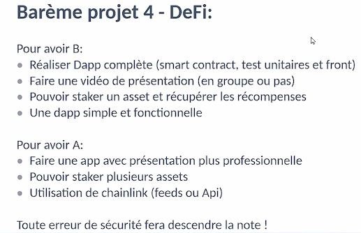

# Alyra-Defi-Project

## Functionnal specifications

- A Staking contract is used to stake any ERC20.
- Any staked ERC20 must be readable in a single unit of measure (ETH/DAI/USDC...) using Chainlink.
- If a token doesn't exist on Chainlink, hardcode a constant to compute it's price.
- The user that staked on the Staking contract will earn rewards with the protocol's ERC20.
- Those rewards are proportionnal to the user stake in the protocol.
- The user is able to claim those tokens and also withdraw its deposit.
- A frontend must be developed.

## Notation

## Links
Demo video: https://www.loom.com/share/4a916012a3f84657b4026fb9580e2175
Code video: https://www.loom.com/share/0a275023aca046f5a2b905dc924af617

